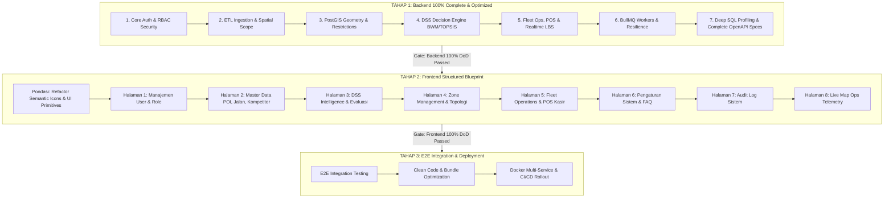

# Roadmap Implementasi End-to-End (E2E) MOVA Single Tenant
## Paradigma: Sequential Strict (Backend Ready First & Optimized -> Frontend Structured Blueprint -> E2E Deployment)

Dokumen ini adalah panduan tunggal urutan eksekusi **End-to-End (E2E)** untuk seluruh sisa item pada [backlog.md](file:///d:/project/mova-new/mova/single-tenant/docs/backlog.md).

Proses pengerjaan dibagi secara **Sequential Strict** ke dalam 3 Tahap Makro:
1. **TAHAP 1: Backend 100% Selesai, Dioptimasi, Diuji & Terdokumentasi (OpenAPI 3.0 / Swagger)**
2. **TAHAP 2: Frontend 100% Selesai (Refactor Ikon/Komponen & 8 Prioritas Halaman Antarmuka)**
3. **TAHAP 3: E2E Integration Testing, Clean Code Audit, Hardening & Docker CI/CD Deployment**



---

# 🚀 TAHAP 1: Backend 100% Selesai, Dioptimasi & Terdokumentasi (Backend-Ready First)

Seluruh logika bisnis, database migrations, pengindeksan SQL/PostGIS, pengujian automated test vectors, dan dokumentasi OpenAPI 3.0 diselesaikan tuntas sebelum antarmuka frontend dibangun.

---

### 1.1. Domain 1: Core Auth, RBAC & Security Baseline
- **Spesifikasi API (`docs/openapi.yaml`)**:
  - `POST /api/auth/login`, `POST /api/auth/refresh-token`, `POST /api/auth/logout`.
  - `GET /api/users`, `POST /api/users`, `PUT /api/users/{id}`, `DELETE /api/users/{id}`.
  - `PUT /api/users/{id}/role`, `POST /api/users/{id}/reset-password`.
- **Implementasi Backend & Security Hardening**:
  - **RBAC & BOLA Guard**: Audit `roleMiddleware.js` & `userRoutes.js`. Akses akun `RIDER`/`SUPERVISOR` ke modul administratif ditolak seketika dengan HTTP 403 Forbidden.
  - **Token Versioning Revocation**: Setiap perubahan role menaikkan `token_version` di database, membatalkan token JWT lama secara instan (`authService.js`, `tokenRepository.js`).
  - **Database Error Masking**: Verifikasi `apiResponse.js` dan `errorHandlerMiddleware.js` agar tidak mengekspos nama kolom/tabel PostgreSQL di production.
- **SQL Indexing**:
  ```sql
  CREATE INDEX idx_users_role ON users(role);
  CREATE INDEX idx_users_token_version ON users(id, token_version);
  ```
- **Automated Test Gate**: `tests/security/rbac_bola.test.js` & `tests/security/token_revocation.test.js`.

---

### 1.2. Domain 2: ETL Ingestion & Spatial Scope Guard
- **Spesifikasi API (`docs/openapi.yaml`)**:
  - `POST /api/pois/sync-osm`, `POST /api/pois/bulk-upload`.
  - `POST /api/roads/sync-osm`, `GET /api/roads/restrictions`.
  - `POST /api/competitors/bulk-upload`.
- **Implementasi Backend & Spatial Guard**:
  - **Spatial Scope Guard**: Validasi PostGIS `ST_Within(geom, ST_GeomFromGeoJSON(operational_scope))` pada `poiSyncService.js` dan `roadSyncService.js`. Data OSM di luar wilayah Sidoarjo dibuang sebelum masuk database.
  - **External API Resilience**: Retry exponential backoff pada `overpassClient.js` & `openMeteoClient.js` dengan timeout 3 menit dan pencatatan riwayat di `data_sync_runs`.
  - **POI Canonical Deduplication**: Pengecekan jarak PostGIS `ST_DWithin(geom, :new_geom, 15)` (15 meter) pada `poiRepository.js` untuk mencegah entitas duplikat.
- **SQL Indexing**:
  ```sql
  CREATE INDEX idx_pois_geom_gist ON pois USING GIST(geom);
  CREATE INDEX idx_roads_geom_gist ON roads USING GIST(geom);
  CREATE INDEX idx_competitor_locations_geom_gist ON competitor_locations USING GIST(geom);
  ```
- **Automated Test Gate**: `tests/spatial/scope_guard.test.js` & `tests/spatial/poi_dedup.test.js`.

---

### 1.3. Domain 3: PostGIS Geometry & Spatial Restrictions
- **Spesifikasi API (`docs/openapi.yaml`)**:
  - `GET /api/zones`, `POST /api/zones`, `PUT /api/zones/{id}`.
  - `GET /api/candidates`, `POST /api/candidates`, `DELETE /api/candidates/{id}`.
- **Implementasi Backend & PostGIS Computing**:
  - **Validasi Topologi Zona Makro**: Validasi `ST_IsValid(geom) = true` dan batasan luas `ST_Area(ST_Transform(geom, 3857))` antara 1.000 m² hingga 5.000.000 m² (`spatialRestrictionService.js`).
  - **Buffer 10m Titik Jualan Mikro vs Jalan Terlarang**: Tolak titik kandidat jika berada dalam buffer $\le 10\text{ m}$ dari jalan protokol/tol (`ST_DWithin(candidate_geom, road_geom, 10)`).
  - **Pencegahan Duplikasi Titik Mikro**: Tolak titik mikro baru jika berjarak $< 5\text{ m}$ dari titik mikro yang sudah ada dalam zona yang sama.
- **SQL Indexing**:
  ```sql
  CREATE INDEX idx_zones_geom_gist ON zones USING GIST(geom);
  CREATE INDEX idx_candidate_locations_geom_gist ON candidate_selling_locations USING GIST(geom);
  ```
- **Automated Test Gate**: `tests/spatial/zone_topology.test.js` & `tests/spatial/candidate_buffer.test.js`.

---

### 1.4. Domain 4: DSS Analytical Engine (Linear Programming BWM & TOPSIS)
- **Spesifikasi API (`docs/openapi.yaml`)**:
  - `POST /api/dss/weights/bwm` (Kalkulasi bobot kriteria optimal & Consistency Ratio).
  - `POST /api/dss/evaluate` (Evaluasi perangkingan alternatif zona berbasis TOPSIS).
  - `GET /api/dss/histories`, `GET /api/dss/histories/{id}` (Snapshot evaluasi).
- **Implementasi Backend & Mathematical Engine**:
  - **Solver BWM (javascript-lp-solver)**: Implementasi pemodelan LP min-max pada `BwmWeightService.js` untuk menghasilkan bobot kriteria non-negatif ($\sum w_j = 1.0$) dan Consistency Ratio (CR) akurat.
  - **Proteksi Pembagian Nol TOPSIS**: Penanganan penyebut nol pada normalisasi matriks vektor $\sqrt{\sum x_{ij}^2} = 0$ di `TopsisEngineService.js` untuk mencegah nilai `NaN`.
  - **Client Tampering Guard**: Controller `dssController.js` mengabaikan bobot buatan klien; seluruh kalkulasi keputusan dilakukan secara independen di server.
  - **Immutability Snapshot Evaluasi**: Kunci tabel `dss_histories` dan `evaluation_snapshots` agar menolak operasi `UPDATE` dan `DELETE`.
- **SQL Indexing**:
  ```sql
  CREATE INDEX idx_dss_histories_created_at ON dss_histories(created_at DESC);
  CREATE INDEX idx_evaluation_snapshots_eval_id ON evaluation_snapshots(evaluation_id);
  ```
- **Automated Test Gate**: `tests/dss/bwm_solver.test.js`, `tests/dss/topsis_engine.test.js`, `tests/dss/tampering_guard.test.js`.

---

### 1.5. Domain 5: Fleet Operations, POS Retail & Realtime LBS (Socket.io)
- **Spesifikasi API & Socket Event (`docs/openapi.yaml`)**:
  - `POST /api/distribution/allocate` (Alokasi zona & armada ke rider).
  - `POST /api/sessions/check-in`, `POST /api/sessions/start-shift`, `POST /api/sessions/check-out`.
  - `GET /api/products`, `POST /api/sales/record`, `DELETE /api/products/{id}`.
  - WebSocket Events: `rider:location_update`, `room:subscribe`, `fleet:telemetry_stream`, `fleet:compliance_alert`.
- **Implementasi Backend, POS & WebSocket Telemetry**:
  - **Anti Race Condition Alokasi**: Transaksi ber-isolasi `SERIALIZABLE` / `SELECT ... FOR UPDATE` pada `DistributionService.js`.
  - **State Machine Sesi Operasional**: Transisi status ketat (`CREATED` $\rightarrow$ `CHECKED_IN` $\rightarrow$ `ACTIVE` $\rightarrow$ `COMPLETED`).
  - **Integritas Harga Ritel Kasir**: Server selalu mengambil `unit_price` dari master `products` saat mencatat transaksi di `sales_logs`.
  - **Product Deletion Guard**: Tolak penghapusan produk (HTTP 409 Conflict) jika memiliki data penjualan di `sales_logs`.
  - **WebSocket Room Segregation**: Verifikasi role pada handshake JWT; cegah akun `RIDER` mendengarkan `management_room` / `supervisors_room`.
  - **GPS Spoofing Guard**: Ikat koordinat ke `socket.user.id`; abaikan `rider_id` palsu di body event.
  - **Deterministik Status Kepatuhan LBS**: Hitung posisi terhadap poligon tugas menggunakan PostGIS: `COMPLIANT`, `DEVIATED`, atau `OUTSIDE_ZONE`.
- **SQL Indexing**:
  ```sql
  CREATE INDEX idx_operational_sessions_rider_status ON operational_sessions(rider_id, status);
  CREATE INDEX idx_sales_logs_session_id ON sales_logs(session_id);
  CREATE INDEX idx_sales_logs_product_id ON sales_logs(product_id);
  CREATE INDEX idx_distribution_plans_status ON distribution_plans(status);
  ```
- **Automated Test Gate**: `tests/operations/allocation_race.test.js`, `tests/operations/sales_price_guard.test.js`, `tests/realtime/socket_lbs.test.js`.

---

### 1.6. Domain 6: BullMQ Workers & Background Processing
- **Implementasi Backend Workers**:
  - **Queue Poisoning & Worker Crash Resilience**: Try-catch aman pada `overpassSyncWorker.js`, `armadaHoldWorker.js`, dan `notificationWorker.js` dengan pengalihan ke Dead Letter Queue (DLQ).
  - **Armada Hold Expiration Worker**: Worker terjadwal untuk mengembalikan armada berstatus `HELD` menjadi `AVAILABLE` setelah melewati `release_at`.
  - **ETL Provenance Tracking**: Pencatatan durasi, status akhir, dan metrik jumlah baris di tabel `data_sync_runs`.
- **Automated Test Gate**: `tests/workers/bullmq_resilience.test.js` & `tests/workers/armada_hold.test.js`.

---

### 1.7. Domain 7: Deep SQL Profiling, Index Optimization & 100% Locked OpenAPI Spec
- **Deep Query Profiling & Tuning**:
  - Jalankan `EXPLAIN (ANALYZE, BUFFERS)` pada 10 query terberat sistem (PostGIS intersections, DSS aggregate calculations, multi-filter audit logs).
  - Tuning Connection Pool PostgreSQL (`pool.min`, `pool.max`) di Knex/pg pool.
  - Implementasi caching Redis untuk konfigurasi read-heavy (`operational-scope`, master produk).
- **Finalisasi OpenAPI 3.0 Documentation**:
  - Seluruh endpoint (100%) terdokumentasi lengkap di `docs/openapi.yaml` dan aktif di Swagger UI `/api-docs`.
- **Gate Milestone (DoD Backend 100%)**:
  - ✅ Semua skema endpoint OpenAPI valid & live.
  - ✅ Seluruh automated backend tests lulus (100% Passed).
  - ✅ Seluruh indeks GIST & B-Tree aktif dan diverifikasi via query plan.

---

# 🖥️ TAHAP 2: Frontend 100% Selesai (Refactor Ikon & 8 Prioritas Halaman)

Setelah seluruh API backend stabil, teruji, dan terdokumentasi di Swagger, pembangunan frontend dilakukan dengan mengonsumsi endpoint resmi secara konsisten.

---

### 2.0. Pondasi: Refactor Centralized Semantic Icons & UI Primitives
Sebelum membangun halaman, lakukan refactor pada komponen dasar:
1. **Centralized Semantic Icon System (`frontend/src/components/icons/index.js`)**:
   Membungkus `lucide-react` dengan token semantik, ukuran baku (`sm: 16px`, `md: 20px`, `lg: 24px`), dan `strokeWidth: 1.75px`:
   - `UserIcon`, `UserPlusIcon`, `RoleIcon` (Manajemen Pengguna).
   - `PoiIcon`, `RoadRestrictionIcon`, `CompetitorIcon` (Master Data).
   - `DssIcon`, `WeightsIcon`, `RankingIcon`, `ReportIcon` (DSS Intelligence).
   - `ZoneIcon`, `PolygonIcon`, `CandidatePointIcon` (Zone Management).
   - `FleetIcon`, `SessionIcon`, `DistributionIcon`, `PosIcon` (Fleet & POS).
   - `SystemSettingsIcon`, `FaqIcon`, `ContactAdminIcon` (Pengaturan & FAQ).
   - `AuditLogIcon`, `SearchIcon`, `FilterIcon` (Audit Log).
   - `MapOpsIcon`, `TelemetryIcon`, `LiveStreamIcon` (Map Ops).
   - `SortAscIcon`, `SortDescIcon`, `SortIcon` (Tabel Sorting).
2. **Universal UI Primitives (`frontend/src/components/primitives/`)**:
   - `DataTable`: Komponen tabel universal dengan **Auto-Sort (ASC/DESC)**, pagination, sticky header, dan skeleton loading.
   - `DetailDrawer`: Drawer kanan animasi halus dengan backdrop blur.
   - `ActionModal`: Dialog konfirmasi aksi penting/destruktif.
   - `StatusBadge`: Pill badge status warna semantik (Success, Warning, Danger, Muted).

---

### 2.1. Prioritas 1: Halaman Manajemen User & Role (`/admin/users`, `/admin/users/create`, `/admin/users/:id`)
- **Tujuan**: Pengelolaan akun, mutasi jabatan, pembaruan kontak, dan reset kredensial.
- **Komponen & Fitur**:
  - `DataTable` dengan auto-sorting pada kolom Nama, Email, Role, Status, dan Terakhir Login.
  - Form pembuatan/edit user dengan validasi schema Zod & auto-generate kata sandi sementara.
  - `DetailDrawer` profil user dengan riwayat login dan tombol aksi *Force Logout (Bump Token Version)*.
  - Menu titik tiga (`ActionMenuIcon`) adaptif membuka ke atas di baris bawah.
- **Integrasi API**: `GET /api/users`, `POST /api/users`, `PUT /api/users/{id}`, `PUT /api/users/{id}/role`.

---

### 2.2. Prioritas 2: Halaman Master Data Suite (`/data/pois`, `/data/roads`, `/data/competitors`)
- **Tujuan**: Pengelolaan master geospasial titik keramaian, pembatasan jalan, dan survei kompetitor.
- **Komponen & Fitur**:
  - **Halaman POI (`/data/pois`)**: Card layout modern, multi-kategori filter, pencarian kata kunci, modal bulk upload GeoJSON/CSV, dan **Drawer Detail POI dengan Mini-Map Leaflet** untuk preview posisi koordinat.
  - **Halaman Jalan Protokol & Tol (`/data/roads`)**: Tampilan peta horizontal penuh, toggle layer (Protokol vs Tol), panel ringkasan 3 kolom, tombol sinkronisasi OSM dengan batas tunggu 3 menit.
  - **Halaman Survei Kompetitor (`/data/competitors`)**: Tabel sebaran kompetitor, unggah massal, dan visualisasi radius pengaruh persaingan.
- **Integrasi API**: `GET /api/pois`, `POST /api/pois/bulk-upload`, `GET /api/roads/restrictions`, `POST /api/roads/sync`, `GET /api/competitors`.

---

### 2.3. Prioritas 3: Halaman DSS (Decision Support System) Intelligence (`/intelligence/dss`, `/intelligence/reports`)
- **Tujuan**: Rekomendasi zona berbasis komputasi BWM dan TOPSIS.
- **Komponen & Fitur**:
  - **Tab Konfigurasi Bobot BWM**: Slider interaktif perbandingan kriteria terbaik & terburuk dengan indikator Consistency Ratio (CR) real-time.
  - **Tab Simulasi & Perangkingan TOPSIS**: Tabel hasil rekomendasi dengan skor preferensi $C_i^+$, visualisasi radar chart multi-kriteria, dan penjelasan dampak cuaca/kompetitor.
  - **Tab Riwayat Evaluasi DSS**: View audit log snapshot keputusan historis yang *immutable* (hanya-baca).
- **Integrasi API**: `POST /api/dss/weights/bwm`, `POST /api/dss/evaluate`, `GET /api/dss/histories`.

---

### 2.4. Prioritas 4: Halaman Zone Management & Topologi Spasial (`/operations/zones`, `/operations/zones/:id`)
- **Tujuan**: Pengelolaan poligon zona makro dan titik jualan mikro (*candidate selling points*).
- **Komponen & Fitur**:
  - Editor poligon Leaflet dengan validasi luas (1.000–5.000.000 m²) dan penolakan topologi bersilangan (*self-intersection*).
  - Pemetik titik mikro (*point picker*) dengan **visualisasi lingkaran buffer merah 10m** di sekitar jalan terlarang (otomatis menolak titik yang masuk buffer).
  - Deteksi visual jarak antar titik mikro ($\ge 5\text{ m}$) di dalam zona yang sama.
- **Integrasi API**: `GET /api/zones`, `POST /api/zones`, `GET /api/candidates`, `POST /api/candidates`.

---

### 2.5. Prioritas 5: Halaman Fleet Operations & POS Kasir Ritel (`/operations/riders`, `/operations/sessions`, POS View)
- **Tujuan**: Manajemen armada fisik, alokasi tugas rider, pelacakan sesi lapangan, dan transaksi ritel.
- **Komponen & Fitur**:
  - Tabel unit armada (`AVAILABLE`, `ASSIGNED`, `HELD`, `MAINTENANCE`) dan daftar rider aktif.
  - Wizard alokasi distribusi zona & armada ke rider dengan proteksi transaksi anti-balapan.
  - Timeline sesi harian (`CREATED` $\rightarrow$ `CHECKED_IN` $\rightarrow$ `ACTIVE` $\rightarrow$ `COMPLETED`).
  - **Antarmuka Kasir POS Ritel**: Keranjang belanja cepat, pencatatan metode bayar (Tunai/QRIS), dan harga unit produk terkunci dari server.
- **Integrasi API**: `GET /api/armada`, `POST /api/distribution/allocate`, `POST /api/sessions/check-in`, `GET /api/products`, `POST /api/sales/record`.

---

### 2.6. Prioritas 6: Halaman Pengaturan Sistem & FAQ (`/admin/settings`, `/faq`)
- **Tujuan**: Pengaturan parameter global wilayah operasional, jadwal kerja, panduan sistem, dan saluran bantuan.
- **Komponen & Fitur**:
  - Form konfigurasi parameter wilayah resmi Sidoarjo (bounding box koordinat & titik pusat hub).
  - Form konfigurasi pembagian 4 shift jam operasional (06.00–21.00 WIB).
  - Komponen Accordion Tanya Jawab FAQ interaktif dengan pencarian instan dan tombol aksi *Hubungi Superadmin* yang memicu modal kontak resmi.
- **Integrasi API**: `GET /api/system/settings`, `PUT /api/system/settings`, `GET /api/system/faq`.

---

### 2.7. Prioritas 7: Halaman Audit Log Sistem (`/admin/audit-logs`)
- **Tujuan**: Merekam jejak audit digital seluruh aktivitas pengguna dan mutasi data.
- **Komponen & Fitur**:
  - `DataTable` audit log dengan filter multi-parameter dinamis (Rentang Tanggal, Aktor User, Modul/Entitas, Tipe Aksi).
  - Modal JSON Payload Viewer untuk melihat detail *before-after changes*.
  - Tombol ekspor log ke format CSV/Excel.
- **Integrasi API**: `GET /api/admin/audit-logs`, `GET /api/admin/audit-logs/{id}`.

---

### 2.8. Prioritas 8: Halaman Live Map Ops Telemetry (`/operations/mapops`)
- **Tujuan**: Command center ruang kendali utama monitoring telemetri armada real-time.
- **Komponen & Fitur**:
  - Kanvas peta Leaflet layar penuh terhubung ke WebSocket stream (Socket.io).
  - Marker rider dinamis dengan animasi pergerakan halus dan indikator kepatuhan LBS:
    - 🟢 **Hijau (Compliant)**: Rider berada di dalam zona tugas.
    - 🟡 **Kuning (Deviated)**: Rider berada dalam batas toleransi penyimpangan.
    - 🔴 **Merah (Outside Zone)**: Rider keluar dari wilayah tugas resmi.
  - Layer switchers: Garis batas resmi Sidoarjo (*dashed line*), poligon zona, jalan terlarang, titik POI, titik kompetitor.
  - Panel notifikasi pop-up peringatan deviasi armada secara instan.
- **Integrasi API & WebSocket**: `GET /api/system/operational-scope`, WebSocket events `fleet:telemetry_stream`, `fleet:compliance_alert`.

---

# 📦 TAHAP 3: E2E Integration Testing, Clean Code Audit, Hardening & Docker CI/CD Deployment

Setelah Backend dan Frontend terhubung penuh, tahap finalisasi mencakup pengujian integrasi menyeluruh, pembersihan kode, optimasi build bundle, dan containerization deployment.

---

### 3.1. E2E Integration Testing
- Skenario Uji E2E Lengkap:
  1. Alur Login $\rightarrow$ Token Refresh $\rightarrow$ Role Change Sesi Revocation.
  2. Ingestion OSM $\rightarrow$ Scope Guard Sidoarjo $\rightarrow$ POI Dedup 15m $\rightarrow$ Visualisasi Peta.
  3. Konfigurasi BWM $\rightarrow$ Kalkulasi TOPSIS $\rightarrow$ Rekomendasi Zona $\rightarrow$ Immutability Snapshot.
  4. Alokasi Armada $\rightarrow$ Check-In Sesi $\rightarrow$ Simulasi Telemetri LBS Compliant/Deviated $\rightarrow$ Transaksi Kasir POS.
  5. Audit Log Multi-Filter Query Verification.

### 3.2. Clean Code Audit & Bundle Optimization
- **Backend**: Pengecekan arsitektur 6-layer (Controller $\rightarrow$ Service $\rightarrow$ Repository $\rightarrow$ Database) bebas circular dependencies dan log konsol debug dibersihkan.
- **Frontend**: Vite `manualChunks` code splitting, tree shaking paket ikon `lucide-react`, lazy loading routes pada `AppRoutes.jsx`, dan audit memory leak pada socket event listener.

### 3.3. Multi-Service Containerization (Docker)
- `backend/Dockerfile`: Multi-stage build Node.js Alpine, non-root user, production dependencies pruning.
- `frontend/Dockerfile`: Multi-stage build Vite $\rightarrow$ Nginx Alpine reverse proxy.
- `docker-compose.production.yml`:
  - Service `postgres_postgis`: PostgreSQL 16 + PostGIS extension, volume data persisten.
  - Service `redis`: Redis 7 Alpine dengan password authentication & persistent AOF.
  - Service `mova_backend`: API Node.js app terhubung ke DB dan Redis.
  - Service `mova_worker`: BullMQ worker background daemon process.
  - Service `mova_frontend`: Nginx serving static assets and reverse proxying `/api` & `/socket.io`.

### 3.4. GitHub Actions CI/CD Pipeline (`.github/workflows/deploy.yml`)
- Automated Linter Check (`eslint`).
- Automated Unit & Integration Tests Execution (`npm test`).
- Docker Image Build & Push to Container Registry.
- Automated Zero-Downtime Rollout ke Server Produksi.

---

## 📋 Matriks Rangkuman Eksekusi

| Tahapan | Ruang Lingkup Utama | Kriteria Kesiapan / Output | Status Gerbang (Gate) |
| :--- | :--- | :--- | :--- |
| **TAHAP 1** | **Backend 100% Ready & Optimized**<br/>(Domain 1 s.d. 7) | OpenAPI 3.0 Specs 100% Locked, Semua Audit Security Vectors Passed, PostGIS GIST Indexes Aktif, BullMQ DLQ Ready, `EXPLAIN ANALYZE` Benchmarked | 🛑 Prasyarat Mutlak sebelum Tahap 2 dimulai |
| **TAHAP 2** | **Frontend 100% Ready**<br/>(Refactor Ikon & Prioritas Halaman 1 s.d. 8) | Semantic Icon Wrapper Aktif, DataTable Auto-Sort Terstandarisasi, Seluruh 8 Halaman Terintegrasi ke Live API yang Stabil | 🛑 Prasyarat Mutlak sebelum Tahap 3 dimulai |
| **TAHAP 3** | **E2E Integration & Deployment**<br/>(Testing, Clean Code, Docker CI/CD) | Skenario Uji E2E Lulus, Production Vite Bundle Optimized, Multi-Service Docker Compose Siap, CI/CD Pipeline Terverifikasi | 🚀 Sistem Siap Operasional Penuh |
