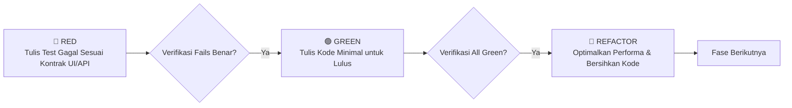

# PART 00 — TATA KELOLA ARSITEKTUR, RADIX UI NATIVE & STANDAR TDD

> **Status Dokumen**: 🏛️ **FOUNDATIONAL RECONSTRUCTION BLUEPRINT**  
> **Referensi SSOT**: [`MAPING_UI_UX.md`](file:///f:/01_Projects/apps/mova-app/mova_app/single-tenant/frontend/docs/MAPING_UI_UX.md)  
> **Target Aplikasi**: MOVA Single-Tenant Frontend (`mova_app/single-tenant/frontend`)  
> **Prinsip Panduan**: [`radix-ui-design-system`](file:///f:/01_Projects/apps/mova-app/.agents/skills/radix-ui-design-system/SKILL.md), [`web-design-guidelines`](file:///f:/01_Projects/apps/mova-app/.agents/skills/web-design-guidelines/SKILL.md), [`ui-ux-pro-max`](file:///f:/01_Projects/apps/mova-app/.agents/skills/ui-ux-pro-max/SKILL.md), [`test-driven-development`](file:///f:/01_Projects/apps/mova-app/.agents/skills/test-driven-development/SKILL.md)

---

## 1. Tujuan & Filosofi Desain

Menetapkan standar fondasi teknis, infrastruktur *state management*, *API client*, sistem token desain visual (*Neural Command DNA*), komponen primitif Radix UI *headless*, serta protokol *Test-Driven Development (TDD)* yang ketat untuk seluruh implementasi frontend MOVA.

```text
┌────────────────────────────────────────────────────────────────────────────────────────┐
│                        PRINSIP UTAMA DESAIN ANTARMUKA MOVA                             │
├────────────────────────────────────────────────────────────────────────────────────────┤
│ 🖥️ DESKTOP CONTROL ROOM (Superadmin, Management, Supervisor)                           │
│ • RADIX NATIVE: Menggunakan primitif murni tanpa wrapper opini bawaan pihak ketiga.     │
│ • DENSE BUT CALM: Kepadatan data optimal, hierarki visual tegas, nol polusi dekorasi. │
│ • RECTANGULAR GEOMETRY: Sudut komponen tajam/subtle (rounded-sm/none), hindari pill.   │
│ • LOW VISUAL NOISE: Tidak menggunakan gradient berlebihan, card soup, atau warna neon.│
│                                                                                        │
│ 🗺️ MAPOPS WORKSPACE (Live Operations & Spatial Zones)                                  │
│ • MAP-FIRST: Kanvas peta GIS sebagai workspace utama viewport.                         │
│ • PANEL-SECOND: Panel detail menggunakan Slide-over Drawer / Sheet Radix.             │
│ • TABLE-THIRD: Tabel agregat berada di bawah atau tab sekunder, bukan menutupi peta.   │
│                                                                                        │
│ 📱 RIDER MOBILE PWA (Field Execution)                                                  │
│ • MOBILE-FIRST: Ergonomi satu tangan, target sentuh minimal 44x44 px (WCAG 2.1 AA).    │
│ • ONE DECISION PER SCREEN: Satu fokus tindakan per layar, tanpa tombol bercabang.      │
│ • HIGH VISIBILITY: Kontras tinggi (>= 4.5:1), mudah dibaca di bawah sinar matahari.   │
│ • MINIMAL NAVIGATION: Navigasi bawah 3 tab intuitif (Shift, Spot/POS, Akun).          │
│                                                                                        │
│ 🚫 ANTI-PATTERNS (WAJIB DIHINDARI)                                                    │
│ ❌ giant rounded cards & excessive gradient backgrounds                                │
│ ❌ dashboard card soup (kumpulan puluhan kartu tanpa narasi keputusan)                │
│ ❌ UUID / istilah teknis backend ditampilkan langsung kepada pengguna                 │
│ ❌ 18 kelompok sidebar menu backend (Wajib dikelompokkan ke 5 pilar navigasi)         │
│ ❌ modal-for-everything & decorative charts without decisions                          │
│ ❌ desktop UI squeezed into mobile screen                                              │
└────────────────────────────────────────────────────────────────────────────────────────┘
```

---

## 2. Struktur Token Desain & Palet Warna

Konfigurasi token CSS terpusat (`src/index.css`) menggunakan tema *Neural Command*:

```css
:root {
  /* Neutral Dark Surfaces */
  --bg-primary: #0A0D14;
  --bg-surface: #121826;
  --bg-card: #1E293B;
  --border-subtle: #334155;
  --border-strong: #475569;

  /* Typography & High Contrast */
  --text-primary: #F8FAFC;
  --text-secondary: #94A3B8;
  --text-muted: #64748B;

  /* Brand Accents & Telemetry */
  --color-brand-blue: #2563EB;
  --color-brand-cyan: #06B6D4;
  --color-telemetry-online: #10B981;
  --color-telemetry-warning: #F59E0B;
  --color-telemetry-danger: #EF4444;
  --color-telemetry-offline: #64748B;
}
```

---

## 3. Komponen Primitif Radix UI Headless

Seluruh komponen UI interaktif dibangun di atas `@radix-ui/react-*` dengan pola *asChild composition*:

```text
src/components/ui/
├── Dialog.jsx              # @radix-ui/react-dialog (Modal Form)
├── AlertDialog.jsx         # @radix-ui/react-alert-dialog (Konfirmasi Aksi Destruktif)
├── Sheet.jsx               # Radix Dialog Slide-over (Panel Detail Sisi Kanan)
├── DropdownMenu.jsx        # @radix-ui/react-dropdown-menu (Menu Aksi & Profil)
├── Tabs.jsx                # @radix-ui/react-tabs (Sub-workspace & Filter)
├── Slider.jsx              # @radix-ui/react-slider (Simulator Bobot What-If)
├── Tooltip.jsx             # @radix-ui/react-tooltip (Keterangan Nilai Kriteria DSS)
├── Select.jsx              # @radix-ui/react-select (Dropdown Pemilihan Data)
├── Toast.jsx               # @radix-ui/react-toast (Notifikasi Operasional)
└── Table.jsx               # Native Rectangular Operational Table
```

---

## 4. API Client & TanStack Query State Architecture

### 4.1 Axios Interceptor Terpusat (`src/services/api.js`)
* **Request Interceptor**: Otomatis menyisipkan `Authorization: Bearer <accessToken>`.
* **Response Interceptor**:
  * Menangkap status `401 Unauthorized` untuk mengeksekusi *refresh token* via `POST /api/auth/refresh-token`.
  * Jika refresh gagal, membersihkan sesi dan me-redirect ke `/login`.
  * Memformat error sesuai standar RFC 7807/JSend secara konsisten.

### 4.2 Query Key Factory Pattern (`src/services/queryKeys.js`)
* Menjamin *Single Source of Truth* untuk invalidasi cache data:
  ```javascript
  export const queryKeys = {
    auth: { me: ['auth', 'me'] },
    dashboard: { overview: ['dashboard', 'overview'], alerts: ['dashboard', 'alerts'] },
    lbs: { live: ['lbs', 'live'], zoneLogs: ['lbs', 'zone-logs'] },
    weather: { 
      current: ['weather', 'current'], 
      zone: (id) => ['weather', 'zone', id],
      timeline: (id, date) => ['weather', 'timeline', id, date] 
    },
    distribution: { queue: ['distribution', 'queue'], status: ['distribution', 'status'] },
    dss: { configs: ['dss', 'configs'], history: ['dss', 'history'] },
    zones: { list: ['zones', 'list'], detail: (id) => ['zones', id] },
    rider: { activeSession: ['rider', 'session'], spots: ['rider', 'spots'] },
  };
  ```

---

## 5. Standar Test-Driven Development (TDD)

Mengacu pada aturan ketat TDD: **"NO PRODUCTION CODE WITHOUT A FAILING TEST FIRST"**.



### 5.1 Infrastruktur Pengujian
* **Unit & Component Testing**: `vitest` + `@testing-library/react` + `@testing-library/user-event`.
* **API Mocking**: `msw` (Mock Service Worker) untuk meniru 167 REST endpoints backend.
* **E2E & Flow Testing**: `@playwright/test` untuk pengujian lintas peran dan skenario operasional penuh.
